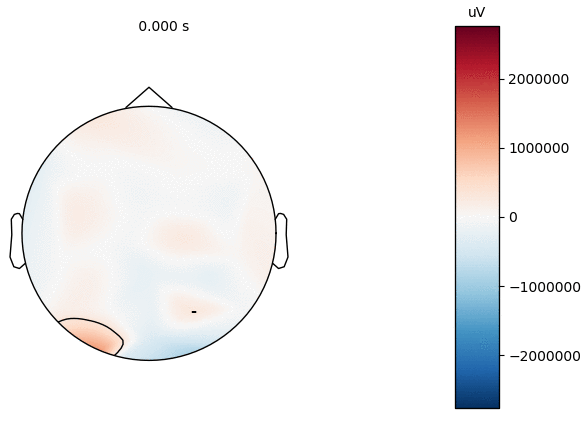

# Brainmation
Toolbox for creating GIFs in Python based on neural time series data.

### Script information 
The script, *makeBrainmation.py*, loads sample EEG data, preprocesses EEG data epoch-wise and generates a topomap animation.
Running the script saves a sample GIF in the current working directory.

#### Dependencies
- [MNE](https://mne-tools.github.io/stable/index.html) for M(EEG) analysis.
- [Matplotlib](https://matplotlib.org/) for plotting animations.
- [ImageMagick](http://www.imagemagick.org/) for saving GIF files.

#### Functions within *makeBrainmation.py*
- createInfo: Creates an MNE info data structure.
- preprocEpoch: Preprocesses epoched (M)EEG data (in collaboration with [Sofie Therese Hansen](https://github.com/STherese)).
- createEvoked: Creates an MNE Evoked structure from a NumPy array containing (M)EEG data. Possibility of adding events/categories associated with individual trials.

#### Files in the repository (sample data)
- EEG.npy: NumPy array containing 40 EEG epochs recorded with [Enobio 32](https://www.neuroelectrics.com/products/enobio/) with a sampling frequency of 500 Hz. Length of epochs is 900 ms (100 ms pre and 800 ms post stimulus onset).
- y.npy: NumPy array containing conditions for EEG epochs. 0 corresponds to a visual 'scene' stimuli, and 1 corresponds to a visual 'face' stimuli. Optional whether to use conditions for animations.

#### Example output 

Example of an animated brain topomap. The EEG data was temporally detrended, lowpass filtered to 40 Hz, downsampled to 100 Hz, rereferenced to average and baseline corrected (default arguments in the *preprocEpoch* function).

#### Dependencies/Acknowledgements

The implementation is based on:

- [MNE (MEG + EEG data analysis & visualization)](https://mne-tools.github.io/stable/index.html)

- [Matplotlib](https://matplotlib.org/)

- [NumPy](https://www.numpy.org/)

- [ImageMagick](http://www.imagemagick.org/)

*Cognitive Systems, Department of Applied Mathematics and Computer Science, Technical University of Denmark* 

